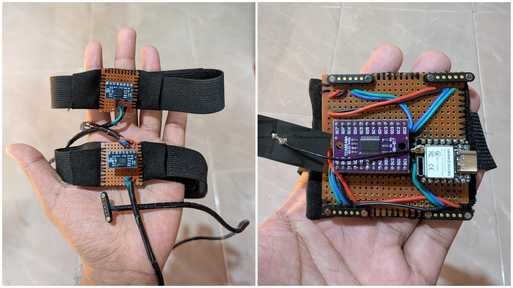
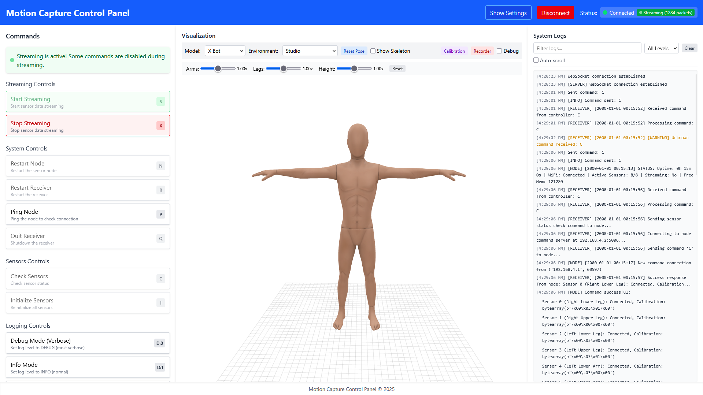
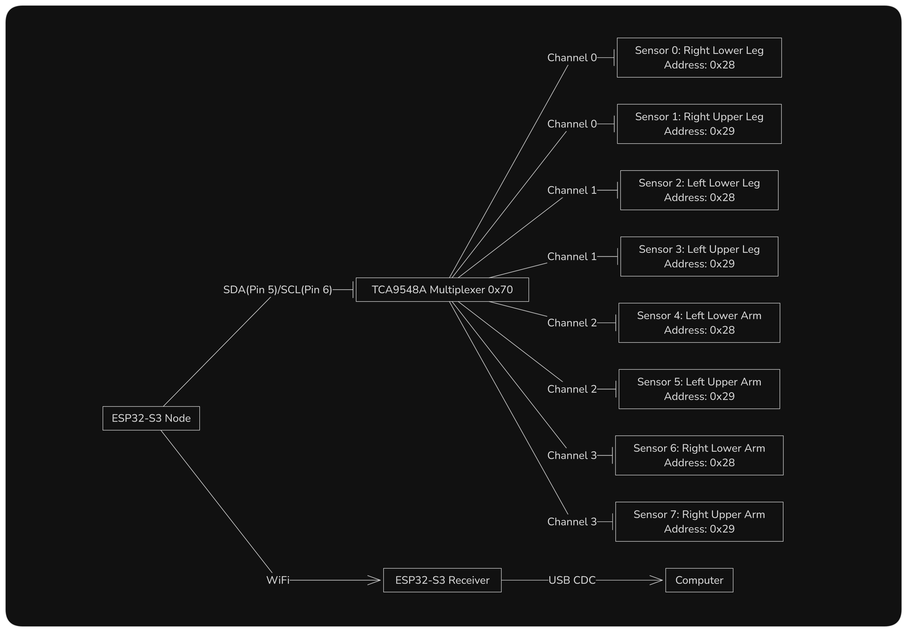
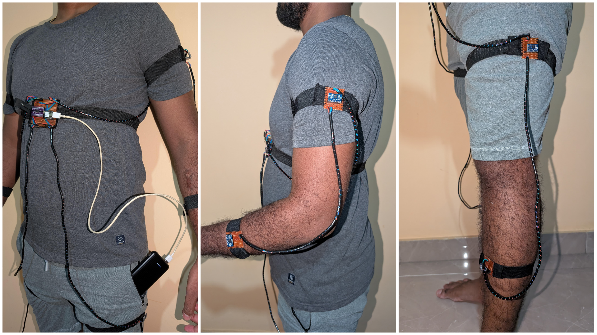
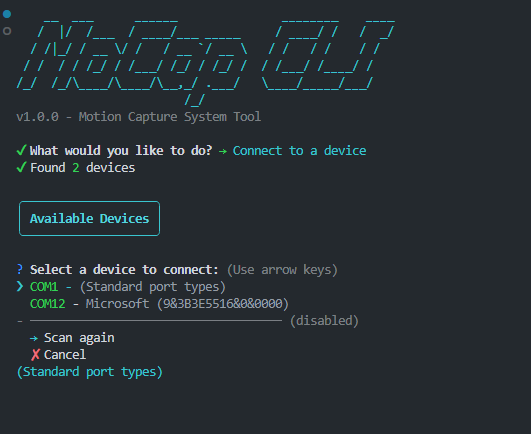

# Motion Capture System

This repository contains the code and documentation for a low-cost, modular motion capture system based on BNO055 IMU sensors. The system consists of ESP32 microcontrollers, multiple BNO055 IMU sensors connected via an I2C multiplexer, and a web application for real-time 3D visualization.

## Table of Contents

- [System Architecture](#system-architecture)
- [Hardware Components](#hardware-components)
- [Communication Protocol](#communication-protocol)
- [Sensor Configuration](#sensor-configuration)
- [Features](#features)
- [Software Setup](#software-setup)
- [Usage](#usage)
- [Command Line Interface](#command-line-interface)
- [Contributing](#Contributing)
- [Troubleshooting](#Troubleshooting)
- [License](#license)
- [Acknowledgments](#Acknowledgments)
- [Contact](#contact)

## System Architecture

The system consists of three main components:

1. **Sensor Node**: An ESP32-S3 microcontroller connected to eight BNO055 IMU sensors via a TCA9548A I2C multiplexer. The node reads sensor data and sends it to the receiver.
   

2. **Receiver**: Another ESP32-S3 microcontroller that acts as a bridge between the sensor node and the computer. It creates a WiFi access point for the node to connect to and communicates with the computer via USB CDC.
   

3. **Control Application**: A web application built with Svelte and Three.js for real-time 3D visualization and system control.



## Hardware Components

- 2× Xiao ESP32-S3 microcontrollers (Node and Receiver)
- 8× BNO055 IMU sensors
- 1× TCA9548A I2C multiplexer
- Connecting wires and power supply

## Communication Protocol

The system uses multiple communication protocols for different purposes:

### Network Configuration

- The Receiver creates a WiFi access point with SSID "MotionCaptureAP"
- The Node connects to this access point as a client
- Static IP addressing is used:
  - Receiver (AP): 192.168.4.1
  - Node: 192.168.4.2

### Communication Channels

1. **TCP Protocol (Port 5006)**: Used for:
   - Command and control messages
   - System logs
   - Status updates
   - Heartbeat messages
2. **UDP Protocol (Port 5005)**: Used for:

   - High-frequency sensor data streaming
   - Optimized for low latency and high throughput
   - Includes sequence numbers for packet loss detection

3. **USB CDC**: Used for:
   - Communication between Receiver and computer
   - Data forwarding from both TCP and UDP channels

### Command System

The system implements a robust command protocol over TCP:

| Command | Description                                           |
| ------- | ----------------------------------------------------- |
| S       | Start streaming sensor data                           |
| X       | Stop streaming sensor data                            |
| C       | Check sensor status                                   |
| I       | Initialize/reinitialize sensors                       |
| N       | Restart node                                          |
| R       | Restart receiver                                      |
| P       | Ping node (connection test)                           |
| D:n     | Set debug level (0=DEBUG, 1=INFO, 2=WARNING, 3=ERROR) |
| Q       | Quit (emergency stop)                                 |

## Sensor Configuration

### BNO055 Sensor Configuration

The BNO055 sensors provide 9-axis motion tracking with built-in sensor fusion. They output:

- Quaternion orientation data
- Calibration status
- Temperature readings

### I2C Multiplexer Setup

The system connects 8 BNO055 sensors using a TCA9548A I2C multiplexer. The configuration is:

- TCA9548A I2C Address: 0x70
- BNO055 Sensors:
  - Sensors alternate between addresses 0x28 and 0x29
  - Each multiplexer channel hosts 2 sensors (one at each address)



## Features

### Node Features

1. **Multi-Sensor Management**:

   - Efficiently reads data from 8 BNO055 sensors using I2C multiplexing
   - Implements time-division access to each sensor
   - Handles sensor calibration and status monitoring

2. **Robust Communication**:

   - Sends sensor data via UDP for high-frequency streaming
   - Uses TCP for commands, logs, and heartbeats
   - Implements error handling and retry mechanisms

3. **Advanced Error Recovery**:

   - Detects and handles sensor disconnections
   - Provides I2C bus recovery mechanisms
   - Implements multiplexer reset capabilities

4. **System Monitoring**:
   - Tracks memory usage
   - Reports active sensor count
   - Provides detailed logging with configurable verbosity

### Receiver Features

1. **Network Management**:

   - Creates and manages WiFi access point
   - Handles TCP and UDP socket creation
   - Monitors network connections

2. **Command Processing**:

   - Routes commands from computer to node
   - Processes responses and forwards to computer
   - Implements command validation and error handling

3. **Data Streaming**:

   - Receives UDP sensor data from node
   - Processes and forwards to computer
   - Tracks packet statistics (lost packets, rate)

4. **USB Communication**:
   - Provides interface between wireless network and computer
   - Handles bidirectional communication
   - Formats data for downstream processing

### Web Application Features

1. **Real-time Visualization**:

   - 3D model rendering with Three.js
   - Real-time motion tracking
   - Customizable visualization options

2. **System Control**:

   - Command interface for system control
   - Status monitoring and notifications
   - Diagnostic tools

3. **Data Processing**:
   - Sensor data parsing and interpretation
   - Calibration and correction tools
   - Performance analytics

## Software Setup

### Prerequisites

- Node.js 18+ and npm/pnpm
- Python 3.8+ (for development tools)
- Serial port access on your computer

### Installation

1. **Clone the repository:**

   ```bash
   git clone https://github.com/chandikajayaweera/MoCap-Suit.git
   cd MoCap-Suit-master
   ```

2. **Install dependencies:**

   ```bash
   cd app
   npm install
   ```

3. **Flash firmware to ESP32 devices:**

   - Connect the ESP32 for the receiver
   - Use PyMakr or Thonny IDE to upload the `esp32/receiver` files
   - Connect the ESP32 for the sensor node
   - Use PyMakr or Thonny IDE to upload the `esp32/node` files

4. **Start the application:**

   ```bash
   npm run dev
   ```

5. **Access the interface:**
   Open your browser and navigate to `http://localhost:5173`

## Usage

### Connecting to the System

1. Connect the receiver ESP32 to your computer via USB
2. Power on the sensor node ESP32 using a portable power bank
3. In the web interface, select the COM port for the receiver
4. Click "Connect" to establish communication

### Sensor Placement

Attach the sensors to the following body parts:

- Sensor 0: Right Lower Leg
- Sensor 1: Right Upper Leg
- Sensor 2: Left Lower Leg
- Sensor 3: Left Upper Leg
- Sensor 4: Left Lower Arm
- Sensor 5: Left Upper Arm
- Sensor 6: Right Lower Arm
- Sensor 7: Right Upper Arm



### Calibration

1. Stand in a T-pose position
2. In the web interface, open the "Calibration" panel
3. Click "Capture T-Pose" to set the reference orientation
4. Use the advanced adjustments to fine-tune individual sensors if needed

### Recording and Playback

1. Open the "Recorder" panel in the web interface
2. Enter a name for your recording
3. Click "Start Recording" to begin capturing motion
4. Click "Stop Recording" when finished
5. Select a recording from the list to play it back

### Command Interface

The system supports the following commands:

- **S**: Start streaming
- **X**: Stop streaming
- **C**: Check sensors
- **I**: Initialize sensors
- **P**: Ping node
- **N**: Restart node
- **R**: Restart receiver
- **D:0-3**: Set debug level

These commands can be sent from the web interface or using the CLI tool.

## Command Line Interface

For advanced users, a command-line interface is available:

```bash
cd app
npm run cli
```

The CLI provides direct access to all system commands and real-time data monitoring.



## Troubleshooting

### Common Issues

- **No serial ports detected**: Ensure you have the correct drivers installed for your ESP32 devices
- **Connection fails**: Check that both ESP32 devices are powered and the receiver is properly connected via USB
- **Sensors not responding**: Verify the wiring and connections to the multiplexer
- **Inaccurate motion**: Follow the calibration procedure and ensure sensors are securely attached

### Debug Mode

Enable debug mode in the web interface to view detailed logs and sensor data.

## Contributing

Contributions are welcome! Please feel free to submit a Pull Request.

1. Fork the repository
2. Create your feature branch: `git checkout -b feature/amazing-feature`
3. Commit your changes: `git commit -m 'Add some amazing feature'`
4. Push to the branch: `git push origin feature/amazing-feature`
5. Open a Pull Request

## License

This project is licensed under the Creative Commons Attribution-NonCommercial 4.0 International License (CC BY-NC 4.0).

### What this means:

- You are free to share and adapt this work for non-commercial purposes
- You must provide appropriate credit to the original author (Nambige C Jayaweera)
- You cannot use this work for commercial purposes without permission

For more details, see the [full license text](https://creativecommons.org/licenses/by-nc/4.0/legalcode).

## Acknowledgments

- Peter Hinch for the BNO055 MicroPython driver
- The original Adafruit CircuitPython BNO055 driver by Radomir Dopieralski
- Three.js community for 3D visualization tools
- Svelte team for the reactive UI framework

## Contact

If you have any questions or feedback, please open an issue in the GitHub repository or email me at chandikajayaweera@pm.me
