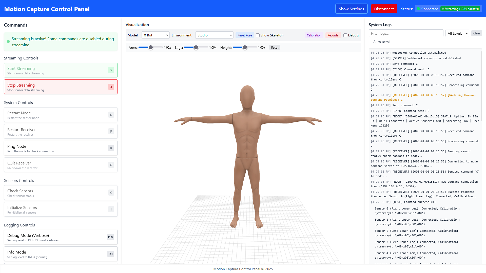
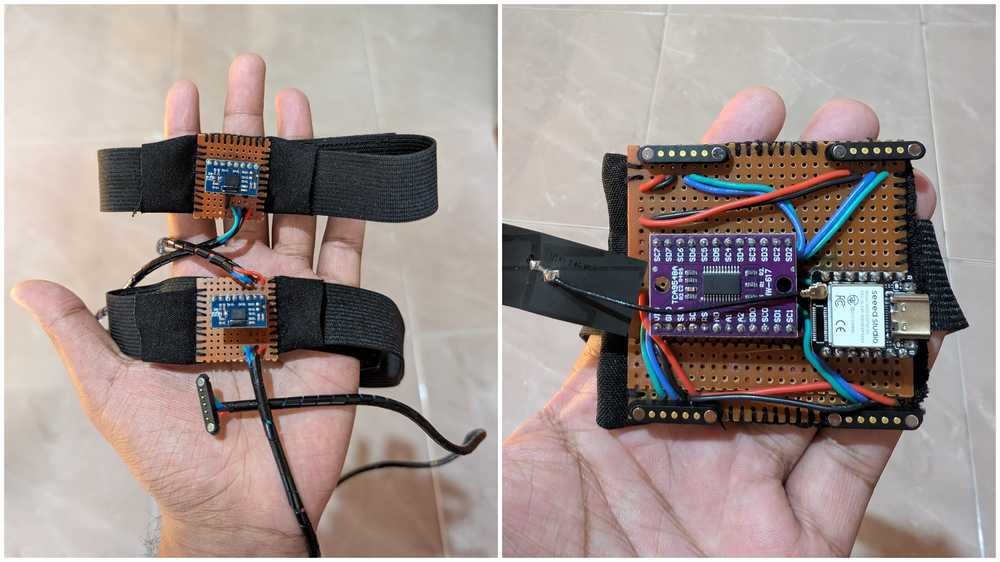
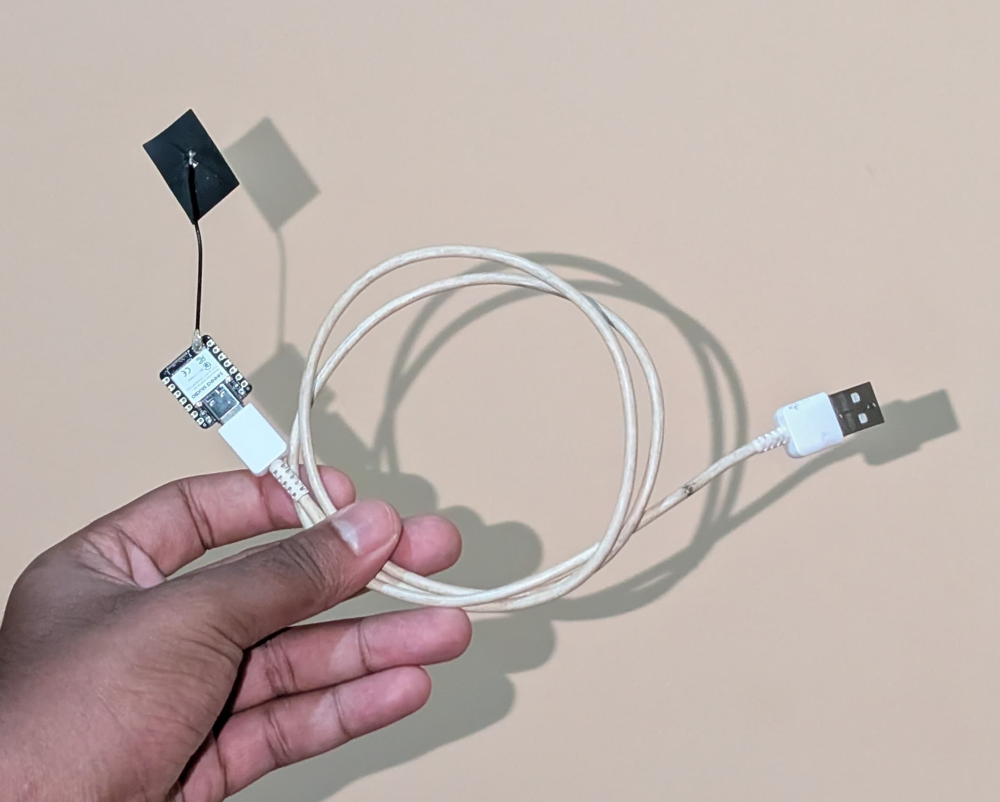
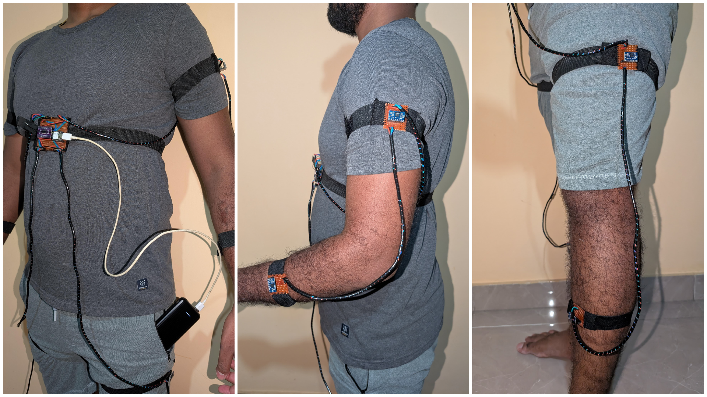

# IMU Motion Capture System

A cost-effective, modular, and wireless motion capture system using BNO055 IMU sensors, ESP32 microcontrollers, and a real-time 3D visualization interface.



## Overview

This motion capture system enables real-time tracking of body movements using inertial measurement units (IMUs). The system is designed to be affordable, portable, and versatile, making motion capture technology accessible for applications in gaming, sports analysis, physical rehabilitation, virtual reality, and more.

### Key Features

- **Real-time wireless motion tracking** using quaternion orientation data
- **Modular design** supporting up to 8 BNO055 sensors for different body parts
- **3D visualization interface** built with Svelte and Three.js
- **Recording and playback** capabilities for motion data
- **Calibration tools** for improved accuracy
- **Command-line interface** for advanced control

## System Architecture

The system consists of three main components:

1. **Sensor Node** (ESP32): Connects to multiple BNO055 IMU sensors via an I2C multiplexer, reads sensor data, and transmits it wirelessly to the receiver.

2. **Receiver** (ESP32): Creates a WiFi access point, receives sensor data from the node, and forwards it to the computer via USB.

3. **Control Application**: A web-based interface for real-time 3D visualization, motion recording, and system control.





## Repository Structure

```
motion-capture-system/
├── app/                      # Web application
│   ├── src/                  # Source code
│   │   ├── lib/              # Shared libraries
│   │   │   ├── components/   # UI components
│   │   │   ├── motion/       # Motion processing code
│   │   │   ├── server/       # Server-side code
│   │   │   ├── stores/       # Svelte stores
│   │   │   └── three/        # Three.js visualization
│   │   └── routes/           # Route components
│   ├── mocap-cli/            # Command-line interface tool
│   └── public/               # Static assets
├── esp32/                    # ESP32 firmware
│   ├── node/                 # Sensor node code
│   └── receiver/             # Receiver code
└── docs/                     # Documentation
```

## Hardware Requirements

- 2× Xiao ESP32-S3 microcontrollers (for node and receiver)
- Up to 8× BNO055 IMU sensors
- 1× TCA9548A I2C multiplexer
- 5-pin pogo pin connectors for sensor connections
- Portable power bank
- USB cables
- 28AWG wire for connections
- Solder and soldering equipment

## Software Setup

### Prerequisites

- Node.js 18+ and npm/pnpm
- Python 3.8+ (for development tools)
- Serial port access on your computer

### Installation

1. **Clone the repository:**

   ```bash
   git clone https://github.com/chandikajayaweera/MoCap-Suit.git
   cd MoCap-Suit-master
   ```

2. **Install dependencies:**

   ```bash
   cd app
   npm install
   ```

3. **Flash firmware to ESP32 devices:**

   - Connect the ESP32 for the receiver
   - Use PyMakr or Thonny IDE to upload the `esp32/receiver` files
   - Connect the ESP32 for the sensor node
   - Use PyMakr or Thonny IDE to upload the `esp32/node` files

4. **Start the application:**

   ```bash
   npm run dev
   ```

5. **Access the interface:**
   Open your browser and navigate to `http://localhost:5173`

## Usage

### Connecting to the System

1. Connect the receiver ESP32 to your computer via USB
2. Power on the sensor node ESP32 using a portable power bank
3. In the web interface, select the COM port for the receiver
4. Click "Connect" to establish communication

### Sensor Placement

Attach the sensors to the following body parts:

- Sensor 0: Right Lower Leg
- Sensor 1: Right Upper Leg
- Sensor 2: Left Lower Leg
- Sensor 3: Left Upper Leg
- Sensor 4: Left Lower Arm
- Sensor 5: Left Upper Arm
- Sensor 6: Right Lower Arm
- Sensor 7: Right Upper Arm



### Calibration

1. Stand in a T-pose position
2. In the web interface, open the "Calibration" panel
3. Click "Capture T-Pose" to set the reference orientation
4. Use the advanced adjustments to fine-tune individual sensors if needed

### Recording and Playback

1. Open the "Recorder" panel in the web interface
2. Enter a name for your recording
3. Click "Start Recording" to begin capturing motion
4. Click "Stop Recording" when finished
5. Select a recording from the list to play it back

### Command Interface

The system supports several commands:

- **S**: Start streaming
- **X**: Stop streaming
- **C**: Check sensors
- **I**: Initialize sensors
- **P**: Ping node
- **N**: Restart node
- **R**: Restart receiver
- **D:0-3**: Set debug level

These commands can be sent from the web interface or using the CLI tool.

## Command Line Interface

For advanced users, a command-line interface is available:

```bash
cd app
npm run cli
```

The CLI provides direct access to all system commands and real-time data monitoring.


## Troubleshooting

### Common Issues

- **No serial ports detected**: Ensure you have the correct drivers installed for your ESP32 devices
- **Connection fails**: Check that both ESP32 devices are powered and the receiver is properly connected via USB
- **Sensors not responding**: Verify the wiring and connections to the multiplexer
- **Inaccurate motion**: Follow the calibration procedure and ensure sensors are securely attached

### Debug Mode

Enable debug mode in the web interface to view detailed logs and sensor data.

## Contributing

Contributions are welcome! Please feel free to submit a Pull Request.

1. Fork the repository
2. Create your feature branch: `git checkout -b feature/amazing-feature`
3. Commit your changes: `git commit -m 'Add some amazing feature'`
4. Push to the branch: `git push origin feature/amazing-feature`
5. Open a Pull Request

## License

This project is licensed under the MIT License - see the LICENSE file for details.

## Acknowledgments

- Peter Hinch for the BNO055 MicroPython driver
- The original Adafruit CircuitPython BNO055 driver by Radomir Dopieralski
- Three.js community for 3D visualization tools
- Svelte team for the reactive UI framework

## Contact

If you have any questions or feedback, please open an issue in the GitHub repository.
